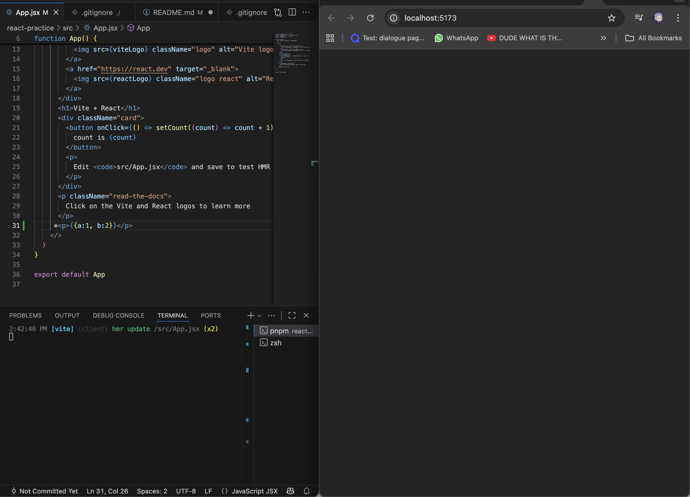

###### Credit to Dave Gray's react tutorial. this document is a compilation of key points from his 9 hour course, which can be found at:
https://www.youtube.com/watch?v=RVFAyFWO4go

# App & JSX
Curly braces indicate a *javascript expression*. A lack of curly braces renders text as is, as it is plain HTML.

Objects cannot be rendered as javascript expression, it will return an error


###### For Vite, you will simply get a blank page, with nothing rendered.

A boolean will not return an error, however it will not render.

To comment, enclose */ */ with curly braces.

Functions are typically started with the word "handle" as convention, and can also be rendered as javascript expressions.

# Functional components

Components such as headers, page content and footers can be separated into separate components and be called upon within the main App.jsx file. This result in code being more readable, increasing maintainability as it is easier to debug.

# Applying CSS Styles

Styles can be applied inline within the respective component files.

For example:

```import React from 'react'
const Header = () => {
  const headerStyle = {

      backgroundColor: 'royalBlue',
      color: '#fff'
  }
  return (
    <header style={headerStyle}>
      <h1>Invite List</h1>
      </header>
  )
}

export default Header```
